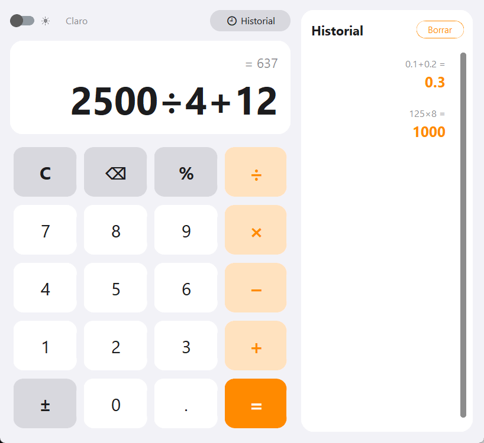
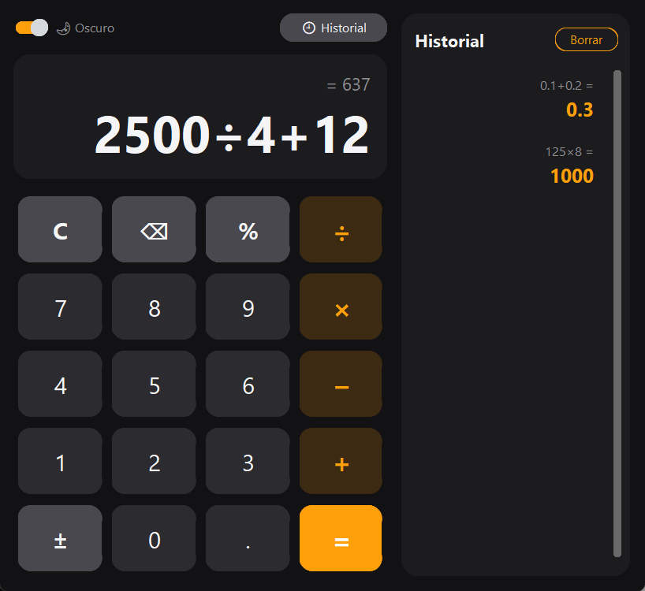

# Mi Calculadora

Calculadora de escritorio hecha en Python con [CustomTkinter](https://github.com/TomSchimansky/CustomTkinter), con tema claro/oscuro, historial de operaciones y soporte de teclado.

| Modo claro | Modo oscuro |
|:---:|:---:|
|  |  |

## Características

- Operaciones básicas: suma, resta, multiplicación y división, respetando la precedencia (`2+3×4 = 14`).
- Porcentaje (`200×15% = 30`), cambio de signo (`±`) y decimales.
- Repetir la última operación pulsando `=` varias veces (`5+3 = = =` → `14`).
- Historial de hasta 50 operaciones; al hacer clic en una, su resultado se inserta en la expresión actual.
- Interruptor de tema claro / oscuro.
- Evaluación segura de expresiones con `ast`, sin usar `eval`.
- Mensajes de error claros (división entre 0, expresión incompleta, número demasiado grande).

## Requisitos

- Python 3.8 o superior (con Tkinter incluido)
- Las dependencias de `requirements.txt`

## Instalación

```bash
git clone https://github.com/CristhDiaz97/mi-calculadora.git
cd mi-calculadora

python -m venv .venv
# Windows
.venv\Scripts\activate
# Linux / macOS
source .venv/bin/activate

pip install -r requirements.txt
```

## Uso

```bash
python main.py
```

### Atajos de teclado

| Tecla | Acción |
|---|---|
| `0`–`9`, `.` o `,` | Escribir números |
| `+` `-` `*` `/` | Operadores |
| `%` | Porcentaje |
| `Enter` | Calcular (`=`) |
| `Retroceso` | Borrar el último carácter |
| `Esc` o `Supr` | Borrar todo (`C`) |
| `Ctrl+C` | Copiar el resultado |

## Pruebas

```bash
python -m unittest test_calculadora.py
```

Las pruebas cubren el motor de cálculo y simulan pulsaciones de botones sobre la interfaz real (sin mostrar la ventana).

## Estructura del proyecto

```
├── main.py               # Punto de entrada
├── ui.py                 # Interfaz gráfica (CustomTkinter)
├── engine.py             # Motor de cálculo seguro y formato de números
├── theme.py              # Colores, fuentes y medidas (claro / oscuro)
├── test_calculadora.py   # Pruebas unitarias
└── requirements.txt      # Dependencias
```
